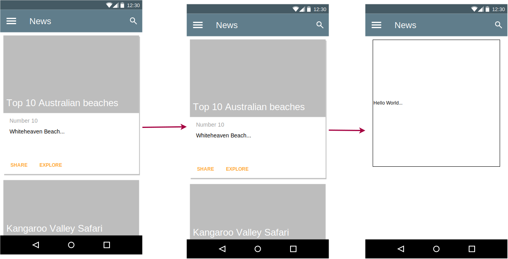

# Visualizing Data Structures and Algorithms with VS Code
Learn visualizing data structures and Algorithms with Extension on VS Code from [🔴 Visualizing Data Structures and Algorithms with VS Code
](https://youtu.be/ElbGMWA6wA4)

## What is inside
- Learn to use Draw.io Integration extensions
- Learn to Debug Visualizer Integration extensions

## Extension
- [Draw.io Integration](https://marketplace.visualstudio.com/items?itemName=hediet.vscode-drawio)
- [Debug Visualizer](https://marketplace.visualstudio.com/items?itemName=hediet.debug-visualizer)

## Draw.io Integration Features
- Edit .drawio, .dio, .drawio.svg or .drawio.png files in the Draw.io editor.
  - To create a new diagram, simply create an empty *.drawio, *.drawio.svg or *.drawio.png file and open it.
  - drawio.svg are valid .svg files that can be embedded in Github readme files! No export needed.
  - drawio.png are valid .png files! No export needed. You should use .svg though whenever possible - they look much better!
  - To convert between different formats, use the Draw.io: Convert To... command.
- Uses an offline version of Draw.io by default.
- Multiple Draw.io themes are available.
- Use Liveshare to collaboratively edit a diagram with others.
- Nodes/edges can be linked with code spans.

## Debug Visualizer Features
- visualizing data structures while debugging
- Much Supported Languages, JavaScript and TypeScript full support
  
## Use Draw.io Extension
- For linked object image to code like Javascript, you can linked with 
  1. Select the object image
  2. Blocks the code
  3. Run Command VS Code (Cmd + Shift + P) Draw.io: Link code with selected node
  4. Try to double click on object image on .dio, you will directed to your code blocks (i can't 🤣)

- Convert draw.io extension to SVG, you can convert to show the diagram on Markdown without make the self svg file. you can convert to png, but later you cant edit it.
  1. Select file .dio
  2. Run Command VS Code (Cmd + Shift + P) Draw.io: Convert To ..., select svg format
  3. You can edit file .drawio.svg and add markdown file
  4. Like on sample below, add image markdown format to README.MD
    This sample to show image draw.io SVG, see huh...

    

    Sample to show wireframe:

    

## Use Debug Visualization Extension
1. Create file and create code Javascript like array or fetch json
2. add `debugger` on last code or respone
3. press F5 or Start Debugging to run debugger on VS Code
4. select variable arr + value `arr = [1,2,3,4]` or response and Run Command VS Code (Cmd + Shift + P) Debug Visualizer: New View or shift + F1 to show debug visualizer
5. You can use visualizer and show data without console.log, Yuhuuuu 😋

# FAQ
**Q: What is .mjs?**

**A:** It indicates an ES6 module file. Read [this](https://stackoverflow.com/questions/57492546/what-is-the-difference-between-js-and-mjs-files)

**Q: What is Palindrome?**

**A: Palindrom adalah kata, frasa, dan angka yang akan terdengar sama walaupun dibaca dari belakang.**